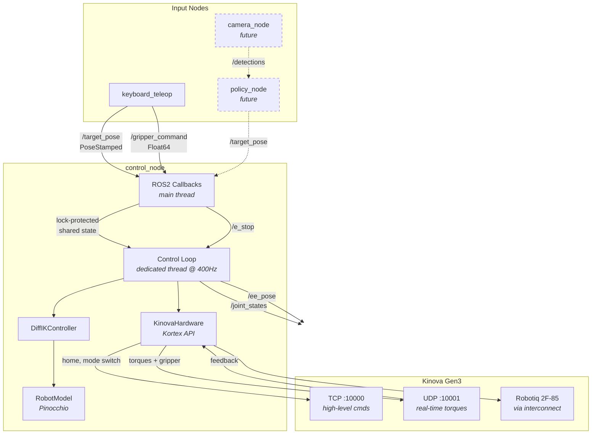
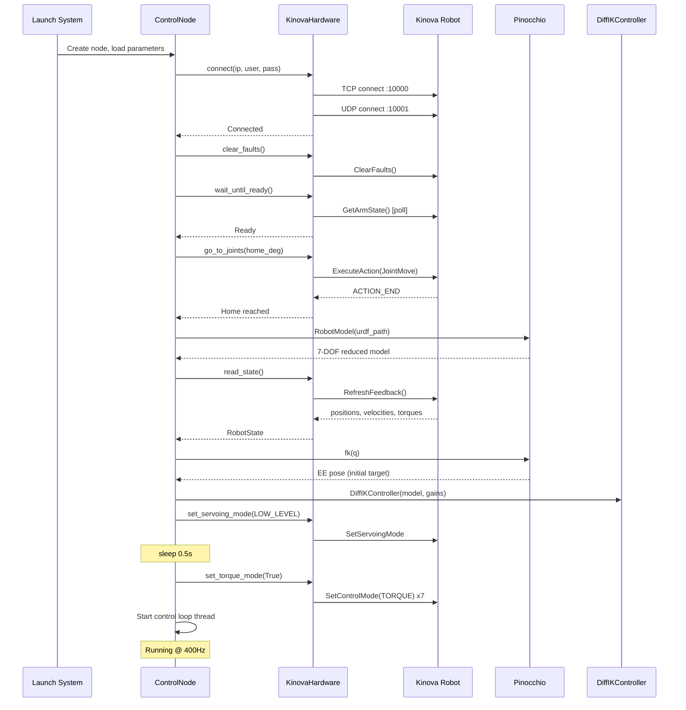
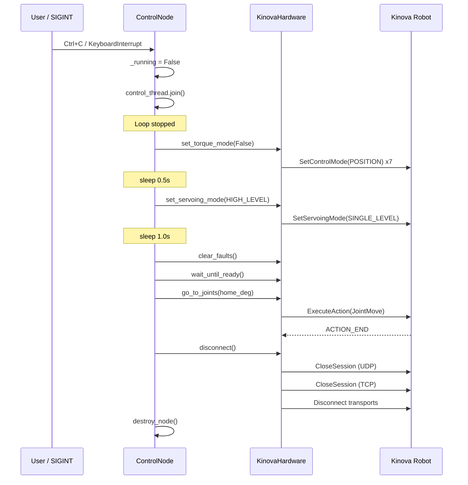
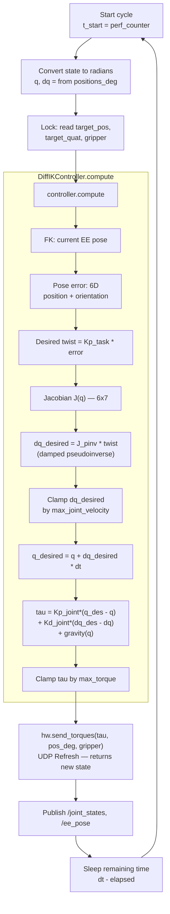
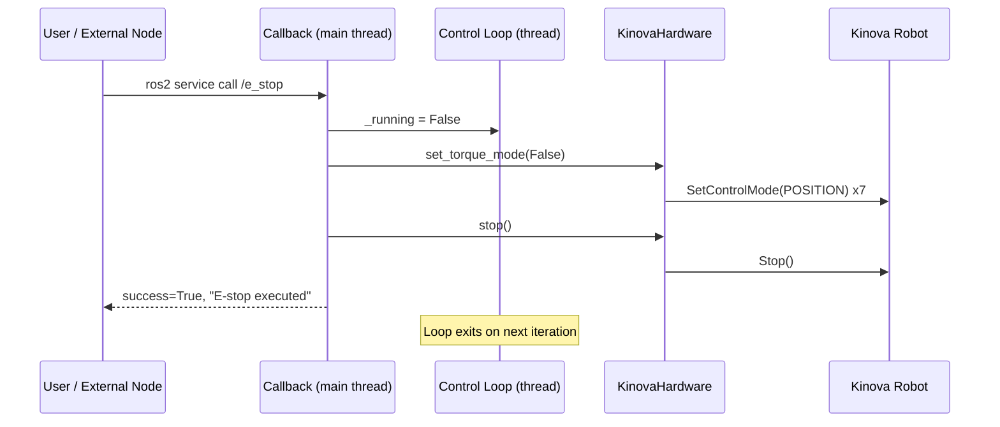
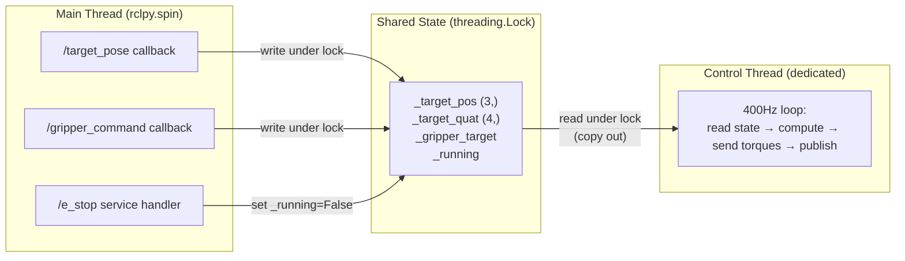
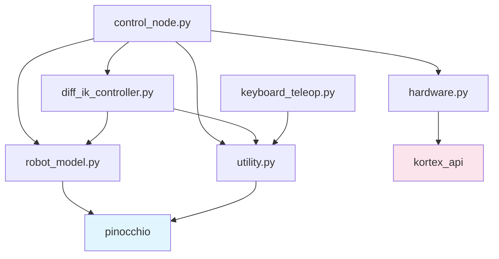
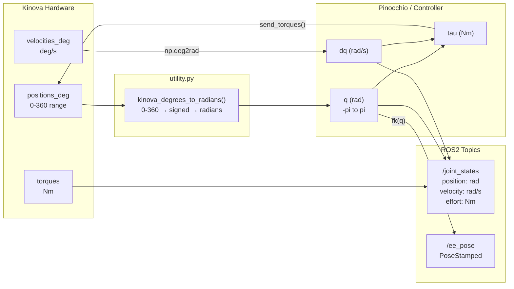
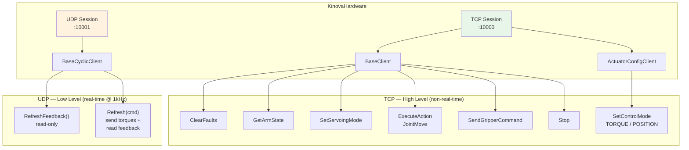

# Manipulators — Diagrams

Mermaid diagrams for the `manipulators` package architecture and behavior.

---

## 1. System Architecture

High-level view of nodes, topics, services, and the hardware layer.

---

## 2. Control Node Startup Sequence

Step-by-step initialization from launch to control loop running.

---

## 3. Control Node Shutdown Sequence

Clean shutdown from SIGINT to disconnect.

---

## 4. Control Loop — Single Cycle

What happens every ~2.5ms (400Hz) inside the control thread.

---

## 5. E-Stop Sequence

Emergency stop triggered via ROS2 service.

---

## 6. Threading Model

How the main thread and control thread interact.

---

## 7. Module Dependency Graph

Import relationships between package modules.

---

## 8. Data Flow — Coordinate Conversions

How joint data is transformed between Kinova, Pinocchio, and ROS2.

---

## 9. Kinova Hardware — Connection Architecture

TCP and UDP dual-connection model.

