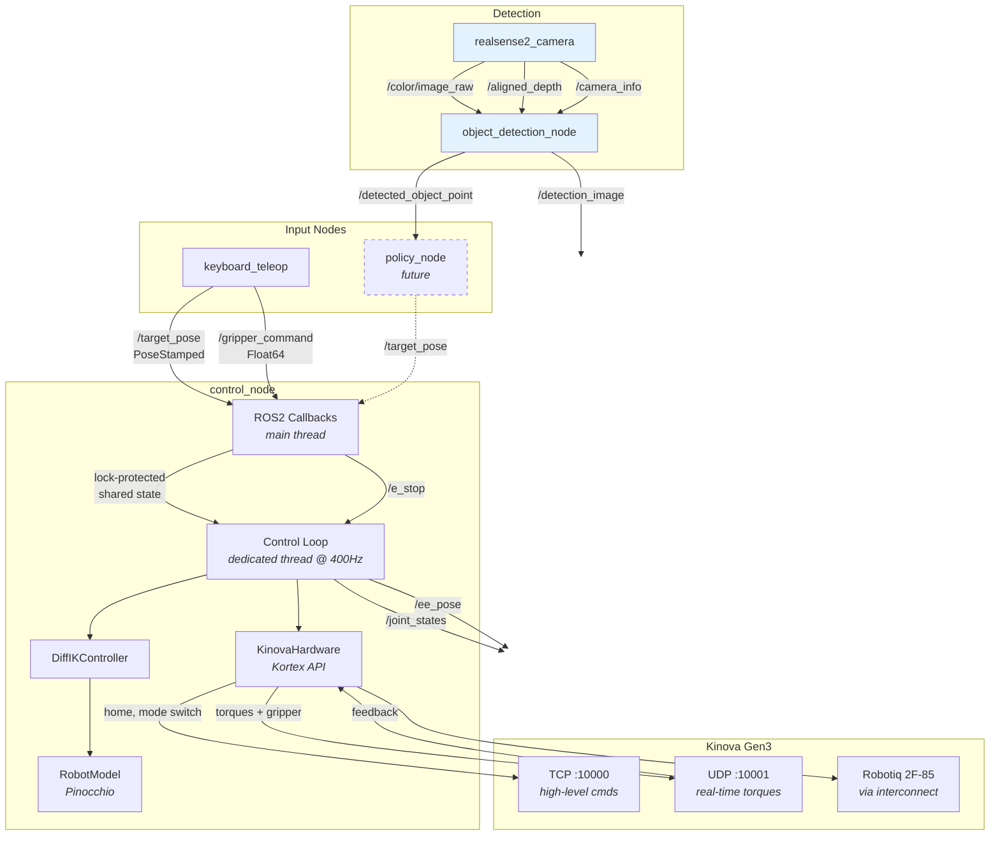
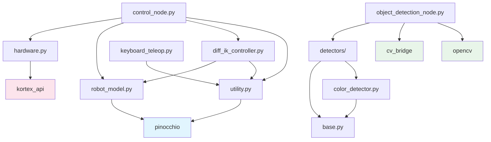
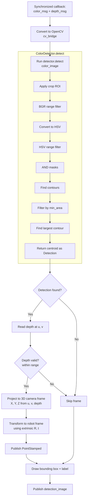
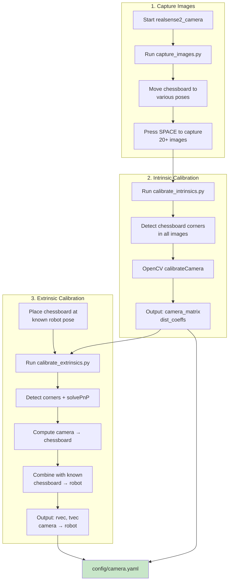
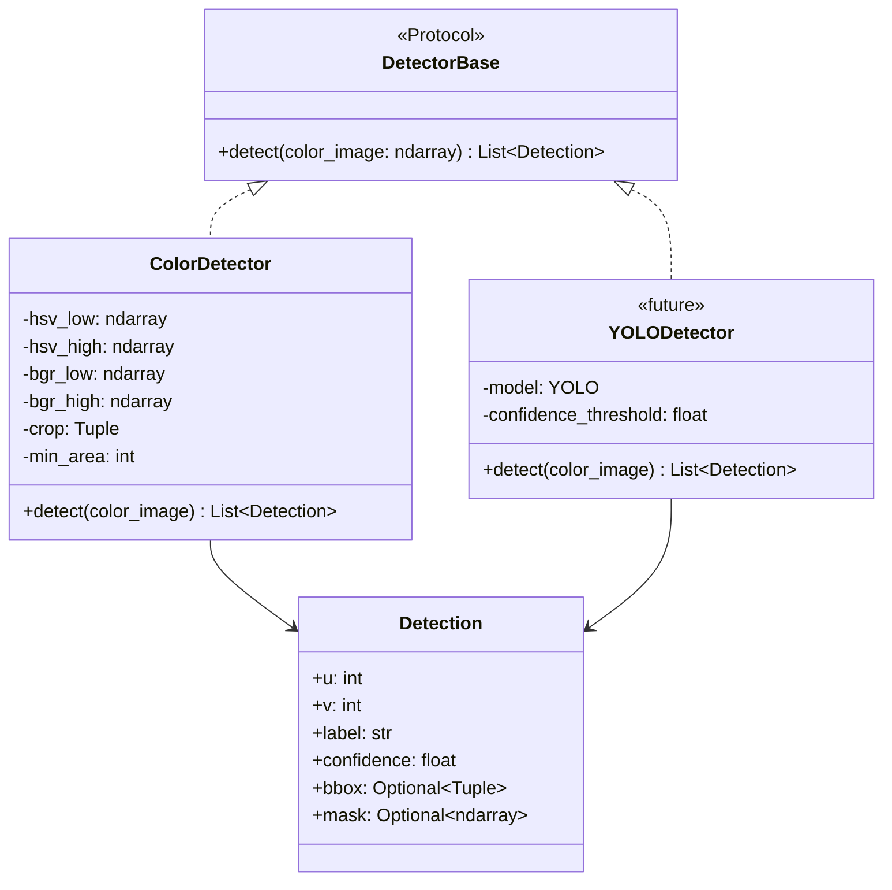
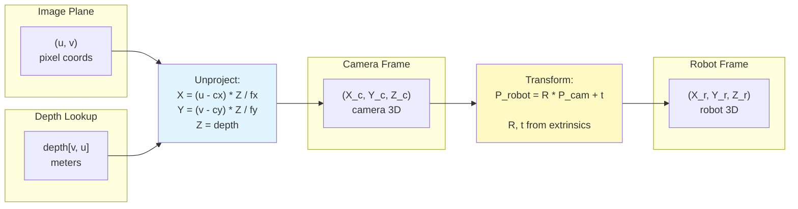

# Manipulators — Diagrams

Mermaid diagrams for the `manipulators` package architecture and behavior.

---

## 1. System Architecture

High-level view of nodes, topics, services, and the hardware layer.



---

## 2. Control Node Startup Sequence

Step-by-step initialization from launch to control loop running.


---

## 3. Control Node Shutdown Sequence

Clean shutdown from SIGINT to disconnect.


---

## 4. Control Loop — Single Cycle

What happens every ~2.5ms (400Hz) inside the control thread.


---

## 5. E-Stop Sequence

Emergency stop triggered via ROS2 service.


---

## 6. Threading Model

How the main thread and control thread interact.


---

## 7. Module Dependency Graph

Import relationships between package modules.



---

## 8. Data Flow — Coordinate Conversions

How joint data is transformed between Kinova, Pinocchio, and ROS2.


---

## 9. Kinova Hardware — Connection Architecture

TCP and UDP dual-connection model.


---

## 10. Object Detection Node Architecture

Internal structure of the detection node with pluggable detector system.

```mermaid
graph TB
    subgraph ROS2 Subscriptions
        C1[/color/image_raw]
        C2[/aligned_depth]
        C3[/camera_info]
    end

    subgraph object_detection_node
        SYNC[message_filters<br>ApproximateTimeSynchronizer]
        DET[Pluggable Detector<br>ColorDetector / YOLODetector / ...]
        PROJ[3D Projection<br>pixel → camera → robot]
        CAL[Camera Calibration<br>intrinsics + extrinsics]
        VIZ[Visualization<br>annotated image]
    end

    subgraph ROS2 Publishers
        P1[/detected_object_point<br>PointStamped]
        P2[/detection_image<br>Image]
    end

    C1 --> SYNC
    C2 --> SYNC
    C3 --> SYNC

    SYNC --> DET
    DET -- "Detection(u, v, label)" --> PROJ
    C2 --> PROJ
    CAL --> PROJ
    PROJ --> P1

    DET --> VIZ
    VIZ --> P2

    style DET fill:#fff9c4
    style PROJ fill:#e1f5fe
```

---

## 11. Detection Pipeline — Single Frame

What happens when a synchronized color + depth frame arrives.



---

## 12. Camera Calibration Workflow

Steps to calibrate camera intrinsics and extrinsics.



---

## 13. Pluggable Detector System

How to add new detectors.



---

## 14. Coordinate Frame Transforms

How 2D pixel coordinates become 3D robot-frame positions.


