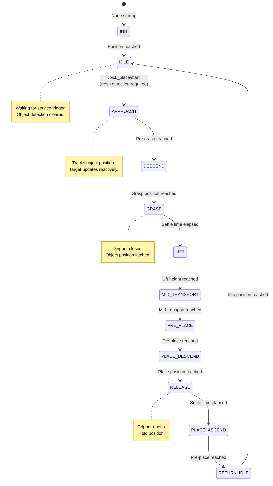
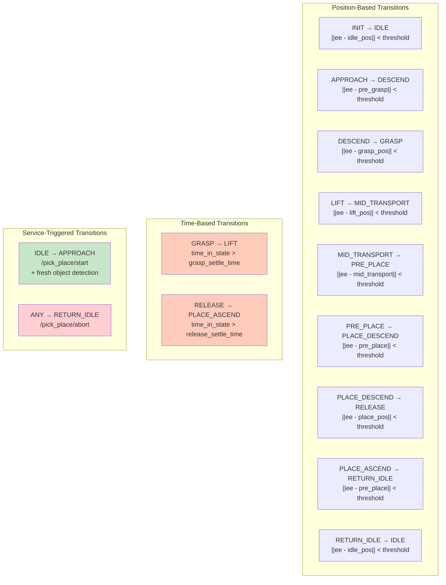
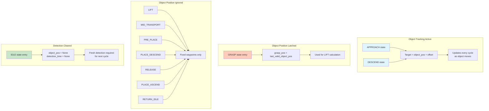
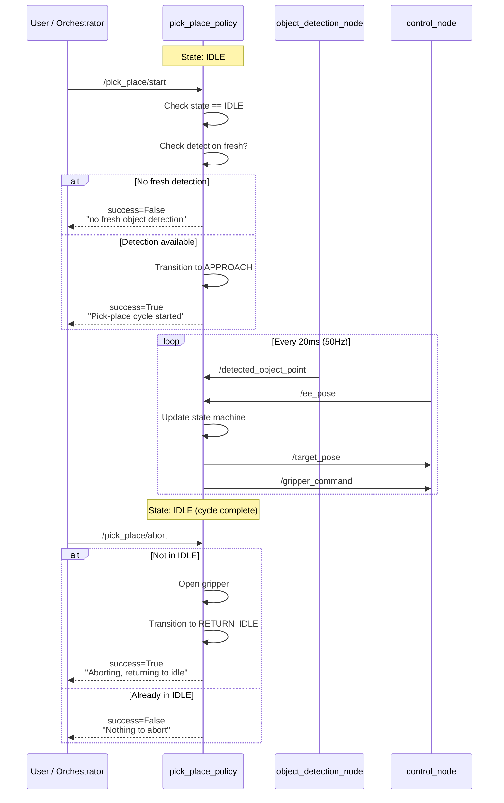
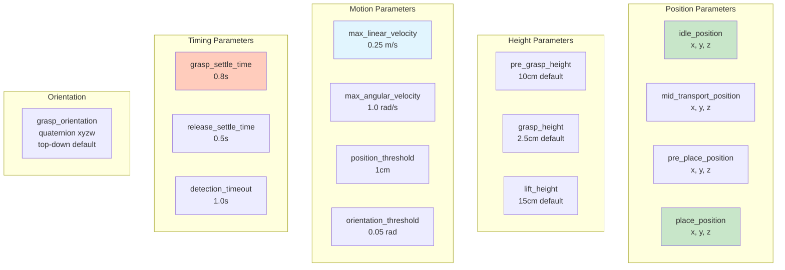
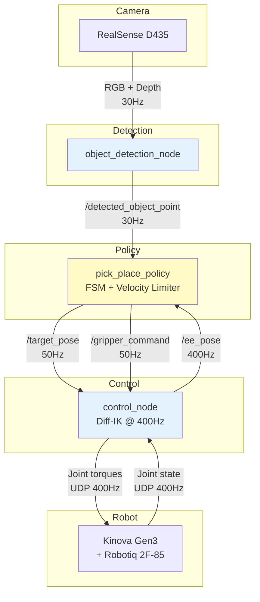

# Pick-Place Policy Diagrams

Mermaid diagrams for the reactive pick-and-place policy, state machine, and motion control.

---

## 1. Policy Node Architecture

How the pick-place policy integrates with the system.

```mermaid
graph TB
    subgraph Inputs
        OD[object_detection_node]
        CN[control_node]
    end

    subgraph pick_place_policy
        FSM[State Machine<br>12 states]
        VEL[Velocity Limiter<br>smooth target updates]
        GRIP[Gripper Controller]
    end

    subgraph Outputs
        TGT[/target_pose]
        GRP[/gripper_command]
    end

    subgraph Services
        START[/pick_place/start]
        ABORT[/pick_place/abort]
    end

    OD -- "/detected_object_point<br>PointStamped" --> FSM
    CN -- "/ee_pose<br>PoseStamped" --> FSM

    FSM --> VEL
    FSM --> GRIP
    VEL --> TGT
    GRIP --> GRP

    START --> FSM
    ABORT --> FSM

    style FSM fill:#fff9c4
    style VEL fill:#e1f5fe
```

---

## 2. State Machine — Full Diagram

Complete state machine with all transitions.



---

## 3. State Machine — Linear Flow

Simplified linear view of the pick-place cycle.

```mermaid
flowchart LR
    INIT --> IDLE
    IDLE --> APPROACH
    APPROACH --> DESCEND
    DESCEND --> GRASP
    GRASP --> LIFT
    LIFT --> MID_TRANSPORT
    MID_TRANSPORT --> PRE_PLACE
    PRE_PLACE --> PLACE_DESCEND
    PLACE_DESCEND --> RELEASE
    RELEASE --> PLACE_ASCEND
    PLACE_ASCEND --> RETURN_IDLE
    RETURN_IDLE --> IDLE

    style IDLE fill:#c8e6c9
    style GRASP fill:#ffccbc
    style RELEASE fill:#ffccbc
    style APPROACH fill:#e1f5fe
    style DESCEND fill:#e1f5fe
```



---

## 4. Velocity-Limited Target Updates

How the policy creates smooth motion by rate-limiting target changes.

```mermaid
flowchart TD
    A[Compute desired_target<br>from current state] --> B[Compute direction<br>desired - current]
    B --> C[Compute distance<br>||direction||]
    C --> D{distance > max_step?}

    D -- Yes --> E["Move toward target:<br>current += (dir/dist) * max_step"]
    D -- No --> F["Snap to target:<br>current = desired"]

    E --> G[Publish /target_pose]
    F --> G

    G --> H[Control node tracks<br>smoothly moving target]

    subgraph "Result: Smooth Motion"
        H --> I[No sudden jumps]
        H --> J[Natural acceleration/<br>deceleration]
        H --> K[Safe behavior for<br>distant objects]
    end

    style D fill:#fff9c4
    style E fill:#e1f5fe
    style F fill:#c8e6c9
```

---

## 5. State Transition Conditions

What triggers each state transition.



---

## 6. Waypoint Positions

Spatial layout of all waypoints in the pick-place cycle.

```mermaid
flowchart TB
    subgraph "Z-axis (height)"
        direction TB
        Z1[idle_position.z]
        Z2[pre_grasp_height<br>above object]
        Z3[grasp_height<br>at object]
        Z4[lift_height<br>above object]
        Z5[mid_transport.z]
        Z6[pre_place.z]
        Z7[place.z]
    end

    subgraph "Pick-Place Path"
        IDLE[IDLE<br>idle_position] --> PRE[PRE_GRASP<br>above object]
        PRE --> GR[GRASP<br>at object]
        GR --> LI[LIFT<br>above object]
        LI --> MID[MID_TRANSPORT<br>waypoint]
        MID --> PREP[PRE_PLACE<br>above place]
        PREP --> PL[PLACE<br>at place]
        PL --> PREP2[PRE_PLACE<br>ascend]
        PREP2 --> IDLE2[IDLE<br>return]
    end

    style GR fill:#ffccbc
    style PL fill:#c8e6c9
    style MID fill:#e1f5fe
```



---

## 7. Object Tracking Behavior

When and how object position is used.



---

## 8. Service Interface

How external nodes trigger pick-place operations.



---

## 9. Configuration Parameters

Visual guide to configurable waypoints and thresholds.



---

## 10. Full System Integration

Complete data flow from detection to robot motion.


